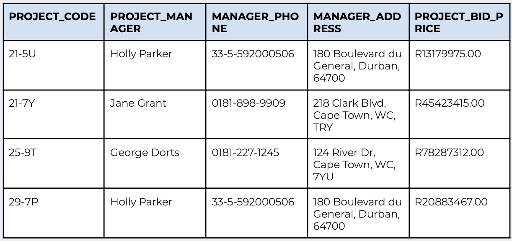

# Database Intro Lab

Answer the following questions:
* Create a text file called databases.txt where you will answer the following questions.

* Explain the difference between data and information.
* Research “sparse data”. What is the alternative? What are the differences
between the two?
* Research and list 3 relational DBMSes and 3 NoSQL DBMSes.
* Look up “transaction consistency”. Describe it in your own words.
* Given the file below, answer the following questions:
    * How many records does the file contain?
    * How many fields are there per record?

